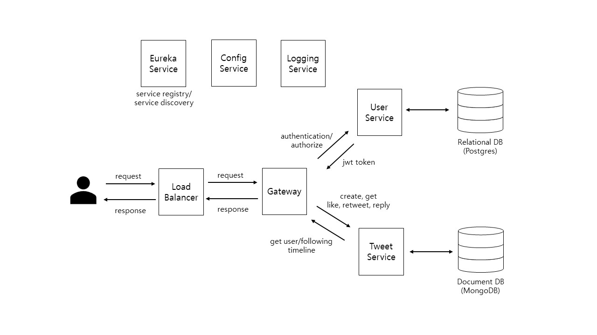

# Project Description:

- Developing a Twitter clone with a focus on implementing a microservices architecture and integrating a CI/CD pipeline.
- The purpose of this project is to deeply understand the latest trend technologies acquired through college education and online courses.

# Technologies:

- AWS, Amazon Linux
- Docker, Kubernetes
- Jenkins, SonarQube, Ansible
- Spring Boot 3, Spring Data JPA (Hibernate 6), Spring Security 6, JWT (JSON Web Token)
- Maven, IntelliJ IDEA, Postman Client
- React JS 18+, Axios, Vite JS, Bootstrap CSS, JavaScript
- NPM, Visual Studio Code IDE
- PostgreSQL, MongoDB
- JUnit, Mockito, Testcontainers

# Tools:

- [Project management](https://github.com/users/jamongx/projects/3)
- [Issue tracker](https://github.com/jamongx/twitter-clone/issues)
- [Wiki](https://github.com/jamongx/twitter-clone/wiki)

# Architecture Diagram
- twitter clone architecture diagram v1.0

# Development Plan

## Phase 1 (Completed)
- [Build CI/CD Pipeline](https://github.com/jamongx/twitter-clone/wiki/build-CI-CD-pipeline)

## Phase 2 (Completed)
- [Gateway Service](https://github.com/jamongx/twitter-clone/tree/main/twitter-clone-gateway-service)
- [Eureka Service (Service Discovery & Service Registry)](https://github.com/jamongx/twitter-clone/tree/main/twitter-clone-eureka-service)
- [Config Service](https://github.com/jamongx/twitter-clone/tree/main/twitter-clone-config-service)
- [Config Repo](https://github.com/jamongx/twitter-clone/tree/main/config-repo)

## Phase 3 (In Progress)
- [Frontend React App](https://github.com/jamongx/twitter-clone/tree/main/twitter-clone-react)
- [User Service](https://github.com/jamongx/twitter-clone/tree/main/twitter-clone-user-service)

## Phase 4
- Tweet Service
- Timeline Service

## Phase 5
- [Logging Service](https://github.com/jamongx/twitter-clone/tree/main/twitter-clone-logging-service)
- Notification Service

## Phase 6
- Search Service
- Message Service
- Ranking Service
- Analytics Service

