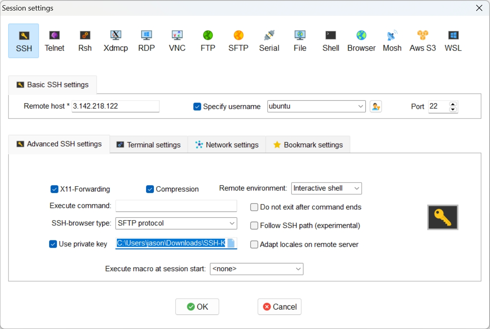

- Install Jenkins on an AWS EC2 instance and complete its initial setup.

### check public ip addr of jenkins instance
3.142.218.122 


### connect using ssh

- Git Bash
```
$ cd Downloads
$ chmod 400 SSH-KEY-Jenkins.pem
$ ssh -i SSH-KEY-Jenkins.pem ubuntu@3.142.218.122
```

- [MobaXterm](https://mobaxterm.mobatek.net/)



### update the package lists on Linux system
```
$ sudo apt update
```

### install openjdk-jre
```
$ sudo apt install openjdk-11-jre -> Y
```


### install jeknins

- https://www.jenkins.io/doc/book/installing/linux/#debianubuntu 

```
curl -fsSL https://pkg.jenkins.io/debian-stable/jenkins.io-2023.key | sudo tee \
  /usr/share/keyrings/jenkins-keyring.asc > /dev/null
echo deb [signed-by=/usr/share/keyrings/jenkins-keyring.asc] \
  https://pkg.jenkins.io/debian-stable binary/ | sudo tee \
  /etc/apt/sources.list.d/jenkins.list > /dev/null
sudo apt-get update
sudo apt-get install jenkins
```


### open a port (8080) of jenkins

Jenkins instance -> Security

Security groups

sg-0421766a2e6255bf0 (launch-wizard-1) -> click

-> Edit inbound rules

Custom TCP -> 8080 Source 0.0.0.0/0

-> Save rule


### check the status of the Jenkins service running and keep the unlock jenkins admin password

```
$ systemctl status jenkins

     CGroup: /system.slice/jenkins.service
             └─4923 /usr/bin/java -Djava.awt.headless=true -jar /usr/share/java/jenkins.war --webroot=/var/cache/jenkin>

Sep 18 06:24:48 ip-172-31-30-234 jenkins[4923]: 49fc397ffa1249f9b234c664a4a5575d -> Unlock Jenkins Admin password
```


### setup jenkins

http://3.142.218.122:8080/

/var/lib/jenkins/secrets/initialAdminPassword -> copy

Install suggested plugins

Create First Admin User

jason

new password

Jason Yang

yangjaemo0319@gmail.com


http://3.142.218.122:8080/

save and Finish

starting using Jenkins


### Add a new Automated Pipeline

New Item

Name -> Automated Pipeline

Source Code Management -> Git

Respository URL -> https://github.com/jamongx/jenkins.git

Branch Specifier (blank for 'any') -> */master -> */main

-> Save

Build Triggers -> GitHub hook trigger for GITScm polling -> Save

GitHub jamongx/jenkins -> Settings -> Webhooks -> Payload URL: http://3.142.218.122:8080/github-webhook/

Which events would you like to trigger this webhook? -> Let me select individual events. -> Pull requests/Pushes -> Save

-> Build Now


###  sonarqube

ubuntu@ip-172-31-30-234:~$ sudo hostnamectl set-hostname jenkins
ubuntu@ip-172-31-30-234:~$ /bin/bash
ubuntu@jenkins:~$


ubuntu@ip-172-31-19-11:~$ sudo hostnamectl set-hostname sonarqube
ubuntu@ip-172-31-19-11:~$ /bin/bash
ubuntu@sonarqube:~$
ubuntu@sonarqube:~$ sudo apt update

ubuntu@sonarqube:~$ sudo apt install openjdk-17-jre


