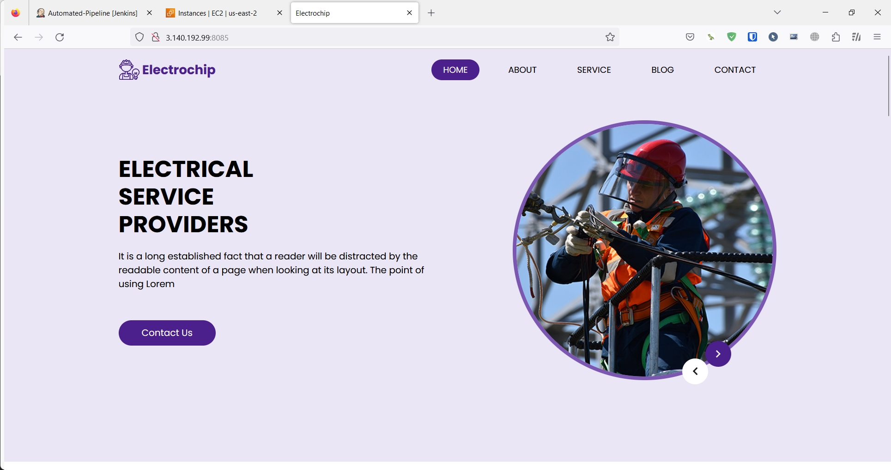

### [Jenkins CI/CD Pipeline - SonarQube, Docker, Github Webhooks on AWS](https://youtu.be/361bfIvXMBI?si=vRGN0VvLwyJ480sG)
- Created instances for Docker, SonarQube, and Jenkins on AWS EC2.
- Connected GitHub and Jenkins, and enabled Webhooks.
- Connected Jenkins and SonarQube.
- Connected Jenkins and the Docker instance.
- Built and ran the website Docker image.

### AWS


### Jenkins


- Project Automated-Pipeline -> Configure -> Build Steps

- Execute shell
```
scp -r ./* ubuntu@3.140.192.99:~/website/
```

- Remote Shell
```
cd /home/ubuntu/website
docker build -t mywebsite .
docker run -d -p 8085:80 --name=Onix-Website mywebsite
```

### SonarQube


### Docker-Server
```Linux
ubuntu@docker:~/website$ docker images
REPOSITORY   TAG       IMAGE ID       CREATED         SIZE
mywebsite    latest    57ba7c31e364   5 minutes ago   188MB

ubuntu@docker:~/website$ docker ps
CONTAINER ID   IMAGE       COMMAND                  CREATED          STATUS          PORTS                                   NAMES
9130f6310402   mywebsite   "/docker-entrypoint.…"   10 seconds ago   Up 10 seconds   0.0.0.0:8085->80/tcp, :::8085->80/tcp   Onix-Website
```

### Result

